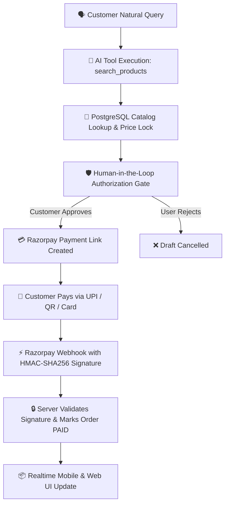

# 🛍️ Checkout Concierge

> **AI-Native Autonomous Commerce Assistant & Deterministic Payment Orchestrator**  
> *Where natural language intent meets strict PostgreSQL transactions and cryptographic Razorpay verification.*

[](https://www.typescriptlang.org/)
[](https://reactnative.dev/)
[](https://vitejs.dev/)
[](https://expressjs.com/)
[](https://supabase.com/)
[](https://razorpay.com/)

---

## 🏛️ Core Security Invariant

> **AI can recommend almost anything. But recommendations aren't transactions.**  
> The AI assistant can recommend products and draft orders, but **financial actions are strictly human-gated**, and payment completion is verified exclusively via cryptographic Razorpay webhooks.



---

## 📂 Repository Structure

```
razorpay-ai-agent/
├── backend/                  # Node.js + Express + TypeScript API
│   ├── src/
│   │   ├── agent/            # Autonomous LLM Orchestrator & Tool Calling
│   │   ├── controllers/      # Chat, Orders, Products, Webhooks, Activity
│   │   ├── middleware/       # HMAC signature validator, rate limits, error handler
│   │   ├── services/         # Razorpay client, Supabase db, audit ledger
│   │   └── types/            # Strict database & domain interfaces
│   └── supabase/             # SQL Migrations & Database Seed catalog
│
├── frontend/
│   ├── Mobile/               # React Native CLI Native Mobile Application
│   │   ├── src/
│   │   │   ├── components/   # Chat bubbles, product carousels, stadium tab bar
│   │   │   ├── hooks/motion/ # useSlideUp, useFadeIn, usePressScale, usePulse
│   │   │   ├── navigation/   # MainTabs (Products, AI, Order) + RootStack
│   │   │   ├── screens/      # Chat, Explore, Orders, PurchaseConfirmation, Payment
│   │   │   ├── store/        # Zustand chatStore & orderStore
│   │   │   └── theme/        # Centralized design tokens & motion physics
│   │   └── ios/ & android/   # Native platform projects
│   │
│   └── Web/                  # Vite + React 19 + Tailwind CSS Web Experience
│       ├── src/
│       │   ├── components/   # Landing sections, interactive tool inspector, ledger
│       │   ├── pages/        # LandingPage, Dashboard, Catalog, Orders, Settings
│       │   └── hooks/        # React Query hooks, theme provider, checkout session
│
└── README.md
```

---

## ⚡ Quick Start

### 1. Prerequisites
- **Node.js** >= 18.0.0 (`node -v`)
- **npm** or **yarn**
- **Supabase Account** (or local PostgreSQL)
- **Razorpay Account (Test Mode)**
- **For Mobile**: Xcode (iOS Simulator) / Android Studio (Android Emulator) & CocoaPods

---

### 2. Configure Backend & Database

1. Navigate to the backend directory:
   ```bash
   cd backend
   cp .env.example .env
   ```

2. Populate `backend/.env` with your API keys:
   ```env
   PORT=3001
   NODE_ENV=development
   SUPABASE_URL=https://your-project.supabase.co
   SUPABASE_SERVICE_ROLE_KEY=your-supabase-service-role-key
   RAZORPAY_KEY_ID=rzp_test_your_key_id
   RAZORPAY_KEY_SECRET=your_key_secret
   RAZORPAY_WEBHOOK_SECRET=your_webhook_secret
   AI_PROVIDER=gemini # or claude / openai
   AI_API_KEY=your_gemini_or_claude_api_key
   ```

3. Initialize the database schema and seed data in your Supabase SQL Editor:
   - Run `backend/supabase/migrations/001_initial_schema.sql`
   - Run `backend/supabase/seed.sql`

4. Install backend dependencies and launch the server:
   ```bash
   npm install
   npm run dev
   ```
   *Backend will run at `http://localhost:3001`.*

---

### 3. Run the Web Application

1. Open a new terminal tab and start the Web frontend:
   ```bash
   cd frontend/Web
   npm install
   npm run dev
   ```
2. Visit **`http://localhost:5173`** in your browser to view:
   - 🌟 Full Landing Page with Dual-Pane Live Interactive Showcase
   - 🔍 Real-Time Agent Tool Dispatch Inspector
   - 📜 Immutable PostgreSQL Audit Table
   - 🛡️ Human-in-the-Loop Security Invariant Comparison
   - 📊 Admin Dashboard (`/dashboard`), Catalog (`/products`), and Orders (`/orders`)

---

### 4. Run the Mobile Application (React Native CLI)

1. Open a new terminal tab and install mobile dependencies:
   ```bash
   cd frontend/Mobile
   npm install
   ```

2. **For iOS**:
   ```bash
   cd ios && pod install && cd ..
   npm run ios
   ```

3. **For Android**:
   ```bash
   npm run android
   ```

4. **Testing on a Physical Mobile Device**:
   - Ensure your phone and computer are on the same Wi-Fi network.
   - Open [`frontend/Mobile/src/services/config.ts`](file:///Users/rishabvyas/Desktop/razorpay-ai-agent/frontend/Mobile/src/services/config.ts) and set:
     ```typescript
     const CUSTOM_LAN_HOST = '192.168.1.XX'; // Your computer's local Wi-Fi IP
     ```

---

## 📱 Mobile Application Architecture

### 1. Stadium Capsule Bottom Navigation
- **Products**: Catalog explorer with category filters, instant search, and staggered item entrances.
- **AI**: Direct conversational AI chat with instant query routing, product carousels, and suggestion chips.
- **Order**: Real-time order history, tracking badges (`PAID`, `PENDING`), and transaction audit trails.

### 2. Premium Motion & Animation System
- **Centralized Physics Tokens** in `src/theme/motion.ts` (durations: 80ms–550ms, spring presets: `gentle`, `snappy`, `subtle`).
- **100% UI-Thread Accelerated** (`useNativeDriver: true`) for 60fps fluid interactions.
- **Accessibility Reduce-Motion Compliance** (`useReduceMotion.ts`) automatically honors system accessibility settings.
- **Animated Components**:
  - `ThinkingIndicator`: Purple stadium pill with 3 staggered animated bouncing dots.
  - `PulsingRing`: Ambient breathing halo for AI avatar and microphone state.
  - `VoiceWaveform`: Equalizing 8-bar audio frequency bars.
  - `PaymentVerificationAnimation`: Rotating progress ring with central security lock.
  - `PaymentSuccessAnimation`: Multi-stage reveal (expanding circle ➔ checkmark ➔ amount ➔ order details).

---

## 💳 Razorpay Test Mode Verification Guide

### Test Card & UPI Credentials
| Payment Method | Test Details |
|---|---|
| **UPI / QR** | Enter any VPA format: `success@razorpay` (or scan generated QR code) |
| **Card Number** | `4111 2222 3333 4444` (or any valid test card) |
| **Expiry / CVV** | Any future date (e.g., `12/28`), CVV: `123` |
| **OTP** | Any 6-digit number (e.g., `123456`) |

### Simulating Webhooks Locally
To test backend webhook delivery without external tunnels:
```bash
curl -X POST http://localhost:3001/api/webhooks/razorpay \
  -H "Content-Type: application/json" \
  -H "x-razorpay-signature: <computed_hmac_signature>" \
  -d '{
    "event": "payment_link.paid",
    "payload": {
      "payment_link": {
        "entity": {
          "id": "plink_test123",
          "order_id": "order_NxK7Pq2d",
          "amount": 149900,
          "status": "paid"
        }
      }
    }
  }'
```

---

## 📡 REST API Reference

| Method | Endpoint | Description |
|---|---|---|
| `GET` | `/api/products` | Query live catalog with price & category filters |
| `GET` | `/api/products/:id` | Fetch specific product details & live inventory |
| `POST` | `/api/chat` | Send conversational turn to autonomous agent |
| `POST` | `/api/orders` | Draft an order in `PENDING_CONFIRMATION` status |
| `GET` | `/api/orders` | Fetch user orders ledger |
| `GET` | `/api/orders/:id` | Fetch specific order state & payment links |
| `POST` | `/api/orders/:id/confirm` | Explicit human purchase authorization gate |
| `POST` | `/api/orders/:id/payment` | Issue Razorpay payment link session |
| `POST` | `/api/webhooks/razorpay` | Cryptographic HMAC-SHA256 webhook ingestion |
| `GET` | `/api/activity/:id` | Fetch full cryptographic audit trail for an order |

---

## 🛡️ Invariants & Guarantees

1. **Zero Hallucinated Pricing**:
   All prices are stored and calculated as integers in **minor units (paise)** on PostgreSQL. The LLM is mathematically prevented from inventing prices or discounts.
2. **Explicit Human Confirmation (HITL)**:
   The agent cannot auto-charge accounts. Orders transition from `ORDER_CREATED` ➔ `PENDING_CONFIRMATION` ➔ `PAYMENT_PENDING` ➔ `PAID`.
3. **No Optimistic Frontend Payments**:
   Payment success is established **only** when Razorpay cryptographically signs the webhook payload.

---

## 📄 License
MIT License. Built for secure, autonomous, and transparent AI-native commerce.
